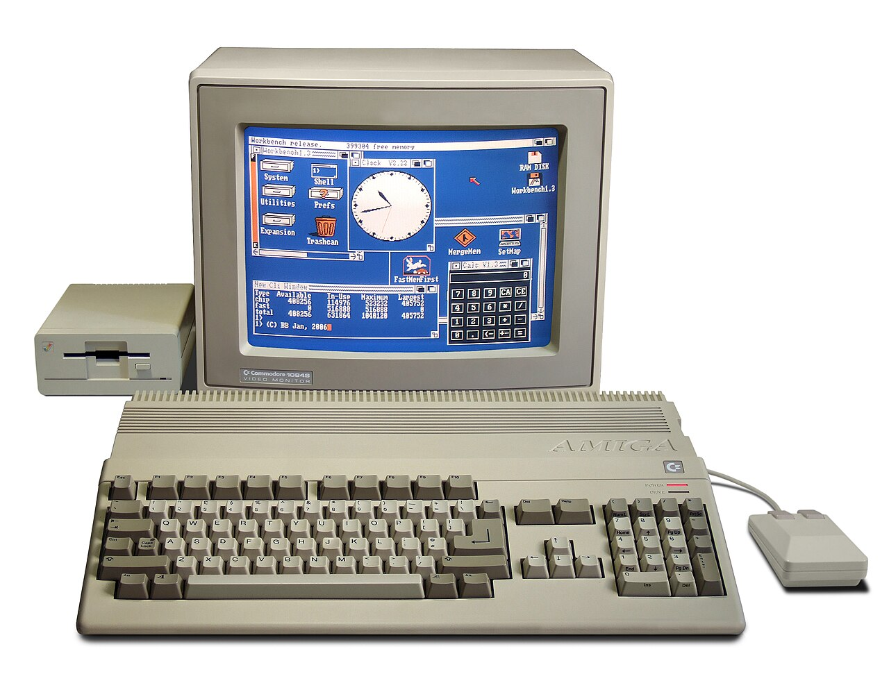

Amiga 500 for MEGA65
====================

Experience the [Commodore Amiga 500](https://en.wikipedia.org/wiki/Amiga_500)
on your [MEGA65](https://mega65.org/)!

This core turns the MEGA65 into an Amiga 500 with the original OCS chipset
(PAL), a cycle accurate 68000 CPU, 512 KB of Chip RAM and a 512 KB memory
expansion in the trapdoor slot (known as Slow RAM, this is what the classic
Commodore A501 expansion did). The Amiga therefore has 1 MB of RAM in total.

The core is work in progress and not officially released yet. There are
rough edges and missing features, but the basics work: Workbench 1.3 boots
from a mounted ADF disk image and classic demos and games load and run.



Credits
-------

* This core is based on the
  [Minimig-AGA core of the MiSTer project](https://github.com/MiSTer-devel/Minimig-AGA_MiSTer).
  Minimig was originally created by Dennis van Weeren and has been improved
  by many others over the years.
* The CPU is [fx68k](https://github.com/ijor/fx68k) by Jorge Cwik, a cycle
  accurate implementation of the 68000.
* [sy2002](http://www.sy2002.de) ported the core to the MEGA65 in 2026.
* The core uses the [MiSTer2MEGA65](https://github.com/sy2002/MiSTer2MEGA65)
  framework and [QNICE-FPGA](https://github.com/sy2002/QNICE-FPGA) for
  FAT32 support (loading the Kickstart ROM, mounting disks) and for the
  on-screen-menu.

Features
--------

* Amiga 500, OCS chipset, PAL
* Cycle accurate 68000 CPU
* 512 KB Chip RAM plus 512 KB Slow RAM (trapdoor expansion), 1 MB in total
* One floppy drive (`df0:`): mount standard 880 KB `*.adf` disk images
  via the on-screen-menu, currently read-only
* Kickstart 1.3
* Real Amiga mouse in port 1, joystick in port 2, exactly like on a
  real Amiga
* MEGA65 keyboard mapped to the Amiga keyboard
* Interlace ("laced") modes with a built-in flicker fixer on HDMI
* Analog output in parallel to HDMI: scandoubled 31 kHz VGA or raw
  15 kHz RGB for CRTs (SCART), selectable in the menu

### Kickstart ROM

The core needs the Kickstart 1.3 ROM (revision 34.5, the 256 KB version
that shipped with the Amiga 500). Put it on your SD card as

    /amiga/kick.rom

as a raw dump of exactly 256 KB (262,144 bytes), no byte swapping. Without
this file the core stops with an error message. Kickstart is copyrighted
software, so it is not part of this repository or of any release; you need
to obtain a legal copy yourself, for example from Cloanto's Amiga Forever.

### Floppy disks

Press <kbd>Help</kbd> to open the menu and mount a `*.adf` image via the
`ADF:` item. The disk boots after mounting. Writing is not supported yet:
every mounted disk appears write protected to the Amiga.

### Mouse and joystick

Plug the mouse into port 1 and the joystick into port 2, the same way you
would on a real Amiga. A real Amiga mouse (the classic "tank mouse") works:
movement and the left button behave exactly like on the original machine.

The right mouse button is the one exception: an Amiga mouse signals it on a
line that the MEGA65 R3 hardware cannot read. Maybe there is a path on the
R6 hardware that we will explore later. The core therefore maps the right
mouse button to the <kbd>Run/Stop</kbd> key. Hold <kbd>Run/Stop</kbd> to
hold the right mouse button, for example to open the Workbench menus while
moving the mouse.

### Keyboard

The most important mappings:

| MEGA65                                                | Amiga                                    |
|-------------------------------------------------------|------------------------------------------|
| <kbd>MEGA</kbd>                                       | Left Amiga                               |
| <kbd>RESTORE</kbd>                                    | Right Amiga                              |
| <kbd>CTRL</kbd> + <kbd>MEGA</kbd> + <kbd>RESTORE</kbd> | Ctrl + Left Amiga + Right Amiga (reset) |
| <kbd>Run/Stop</kbd>                                   | Right mouse button (hold)                |
| <kbd>F1</kbd> <kbd>F3</kbd> <kbd>F5</kbd> <kbd>F7</kbd> <kbd>F9</kbd> | F1, F3, F5, F7, F9      |
| <kbd>Shift</kbd> + F-key                              | F2, F4, F6, F8, F10 (as printed on the MEGA65 keycaps) |
| <kbd>Help</kbd>                                       | Opens and closes the core's menu         |

<kbd>Esc</kbd>, <kbd>Tab</kbd> and <kbd>Caps Lock</kbd> work as expected.
Amiga keys that have no MEGA65 counterpart (for example the right Alt key
and most of the numeric keypad) cannot be typed at the moment.

### Video: HDMI

HDMI outputs 720p at 50 Hz (16:9) by default. The first `HDMI:` menu
entry offers more modes: 720p at 50 or 60 Hz, 576p at 50 Hz (4:3 or 5:4),
640x480 at 60 Hz, 720x480 at 59.94 Hz and 800x600 at 60 Hz.

**The Amiga is a 50 Hz machine, so prefer a 50 Hz mode.** The 60 Hz modes
exist for displays that refuse 50 Hz: scrolling will judder there, and
demos that rely on exact 50 Hz timing (many do) will not look as
intended.

The second `HDMI:` menu entry, directly below the display mode, selects
the scaling filter:

| Filter          | Look                                                      |
|-----------------|-----------------------------------------------------------|
| No Filter       | nearest neighbor: maximum sharpness, visible pixel stairs |
| Sharp Bilinear  | pixel sharp, but with softened stair edges                |
| Bicubic         | smooth all-round interpolation                            |
| Smooth          | soft polyphase scaling                                    |
| Lanczos         | crisp polyphase scaling; the default                      |
| Scanlines       | Lanczos plus visible scanlines                            |
| CRT (S-Video)   | scanlines plus a slightly softened picture, like S-Video  |
| CRT (Composite) | scanlines plus heavy horizontal blur, like an antenna or composite cable |

The core includes a **flicker fixer** for the Amiga's interlace modes:
laced screens such as the 640x512 Workbench or the interlaced pictures
that demos love are woven into a stable, full-resolution HDMI picture —
the same job the A3000's "Amber" chip or an Indivision does on real
hardware. Demos that flicker *on purpose* (alternating two images at
50 Hz to fake extra colors, transparency or glowing lights) keep
flickering: that is the intended look, and only a CRT softens it. If you
want the full story about Amiga video modes and flicker, read
[doc/video_modes.md](doc/video_modes.md).

### Video: VGA port (analog RGB)

The VGA connector always carries the picture in parallel to HDMI. The
`VGA:` menu selects one of three modes:

* **Standard** (default): the Amiga's 15.6 kHz picture is line-doubled to
  31 kHz so that VGA monitors accept it. Note that it is still a 50 Hz
  signal, which not every flat panel likes.
* **15 kHz with HS/VS**: the raw 15.6 kHz RGB signal with separate
  horizontal and vertical sync, for retro monitors with a VGA-style
  input.
* **15 kHz with CSYNC**: the raw 15.6 kHz RGB signal with composite sync,
  which is what RGB SCART cables and most CRT setups expect.

On a 15 kHz CRT you get the most authentic Amiga picture possible:
interlace is displayed natively by the tube (no flicker fixer needed) and
the intentional flicker effects of demos melt on the phosphor exactly as
their authors intended.

Careful: a regular VGA monitor shows **no picture at all** in the 15 kHz
modes — including the on-screen-menu. If you locked yourself out, connect
an HDMI display and switch back there; both outputs share the same menu.

### Audio

Audio is available on HDMI and on the 3.5 mm jack, carrying Paula's
output as-is.

Constraints and roadmap
-----------------------

At this moment the core is an alpha version. The largest known gaps:

* Writing to disk images is not supported yet
* Only one floppy drive (`df0:`)
* No hard disk support
* OCS and PAL only: no ECS, no AGA, no NTSC, no Fast RAM

The list of work-in-progress builds lives in [doc/inofficial.md](doc/inofficial.md).

Installation
------------

There is no official release on the MEGA65 Filehost yet. If you have a
`*.cor` or `*.bit` file of one of the work-in-progress builds:

1. Use a FAT32 formatted SD card with a maximum capacity of 32 GB. The card
   in the back slot has precedence over the card in the bottom slot.
2. Copy the Kickstart ROM to `/amiga/kick.rom` as described above.
3. Optional: copy the `aexp-<version>.cfg` file that comes with the build
   into `/amiga` so that the core remembers your menu settings. Without the
   file nothing breaks, your settings are just not saved. The file name
   contains the core version, so after an upgrade you need the matching
   file and need to re-select your settings once.
4. Put your `*.adf` disk images into `/amiga`, the file browser starts
   there.
5. Flash the `*.cor` file using the MEGA65's bitstream utility, or, if you
   have a JTAG adaptor, load the `*.bit` file directly with the
   [M65 tool](https://github.com/MEGA65/mega65-tools):
   `m65 -q yourbitstream.bit`.
6. Press <kbd>Help</kbd> as soon as the core is running to mount a disk
   and to configure the core.

Developers
----------

Want to build the core from source? Here is the whole path from a fresh
clone to a `*.cor` file. This core is built on the
[MiSTer2MEGA65](https://github.com/sy2002/MiSTer2MEGA65) (M2M) framework,
whose [Wiki](https://github.com/sy2002/MiSTer2MEGA65/wiki) is the
authoritative reference for the build environment and its
operating-system specific details.

### What you need

* **Xilinx Vivado 2022.2** to synthesize the FPGA bitstream. The free
  *ML Standard Edition* covers the MEGA65's Artix-7 (XC7A200T). Vivado runs
  on **Linux and Windows only** — there is no macOS build.
* A **`bash` shell with GCC, `make`, `awk` and `git`**, to build the QNICE
  helper CPU's tool chain and the on-screen-menu firmware.
* A **MEGA65** (R3/R3A, R4, R5 or R6) and a legal **Kickstart 1.3 ROM**
  (see the Kickstart ROM section above) to actually run the result.

Operating-system hints for the `bash` tool chain:

* **Linux:** install `build-essential` (or your distribution's GCC and
  `make` packages), `gawk` and `git`. Everything, including Vivado, runs
  natively.
* **macOS:** `xcode-select --install` provides the compiler and `make`;
  `git` and `awk` are already there. You can build the tool chain and the
  firmware natively, but since Vivado has no macOS build you need to run
  the synthesis on Linux or Windows — for example in a Linux VM (Parallels,
  UTM, VirtualBox) that mounts this working folder.
* **Windows:** Vivado runs natively. For the `bash` tool chain use **WSL2**
  (Ubuntu) or **MSYS2 / Git Bash**.

### Build the core

1. **Clone with all submodules** (the Minimig core, the M2M framework and
   QNICE-FPGA):

   ```bash
   git clone --recursive https://github.com/sy2002/AExp.git
   cd AExp
   ```

   Already cloned without `--recursive`? Pull the submodules in afterwards:

   ```bash
   git submodule update --init --recursive
   ```

2. **Build the QNICE tool chain.** This compiles the assembler and the
   `bit2core` tool natively for your operating system:

   ```bash
   cd M2M/QNICE/tools
   ./make-toolchain.sh
   ```

   Answer every prompt by pressing <kbd>Enter</kbd>. When it finishes,
   return to the repository root (`cd ../../..`).

3. **Open the Vivado project for your board and generate the bitstream.**
   There is one project per MEGA65 revision:

   | Board      | Vivado project     |
   |------------|--------------------|
   | R3 / R3A   | `CORE/CORE-R3.xpr` |
   | R4         | `CORE/CORE-R4.xpr` |
   | R5         | `CORE/CORE-R5.xpr` |
   | R6         | `CORE/CORE-R6.xpr` |

   Run **Generate Bitstream**. Vivado rebuilds the QNICE on-screen-menu
   firmware automatically in a pre-synthesis step, so there is nothing else
   to prepare. The bitstream ends up in
   `CORE/CORE-R3.runs/impl_1/mega65_r3.bit` (substitute your board).

4. **Turn the `*.bit` into a MEGA65 `*.cor` file** with `bit2core` (built in
   step 2 as `M2M/QNICE/tools/bit2core`, or downloaded from the
   [MEGA65 tools](https://github.com/MEGA65/mega65-tools)):

   ```bash
   cd CORE/CORE-R3.runs/impl_1
   bit2core mega65r3 mega65_r3.bit "Amiga 500 for MEGA65" "WIP-V1-A3" AExp-WIP-V1-A3-R3.cor
   ```

   Use the machine string that matches your board — `mega65r3`, `mega65r4`,
   `mega65r5` or `mega65r6` — and the version string from the `CORE_VERSION`
   constant in `CORE/vhdl/config.vhd`. Unlike the C64 core, the Amiga core
   registers no MEGA65 file type (ADFs are mounted from inside its own
   menu), so **no trailing flag argument** is passed to `bit2core`.

5. **Deploy and run.** Copy the `*.cor` to the MEGA65 (or, with a JTAG
   adaptor, flash the `*.bit` directly with `m65 -q mega65_r3.bit`) and
   follow the Installation steps above. Remember that the Kickstart ROM at
   `/amiga/kick.rom` is mandatory — without it the core stops at an error
   screen.

### Settings file

For the core to remember your menu settings, the SD card needs an
`aexp-<version>.cfg` file in `/amiga` (see Installation). Release
packages made with `make_release.py` already contain the matching file.
If you build from source yourself, create one with default settings
using the M2M helper; the `auto` argument reads the required size
straight from `config.vhd`:

```bash
cd M2M/tools
./make_config.sh aexp-WIP-V1-A3 auto
```

Run it from inside `M2M/tools` — the `auto` argument reads the required
size from `config.vhd` via a relative path. Use the same `<version>` as
the `CORE_VERSION` constant in `CORE/vhdl/config.vhd`.

### Going deeper

* `doc/how_to_port.md` is the engineering reference for this port: the M2M
  architecture, the MiSTer-to-MEGA65 porting walkthrough and a
  Quartus-to-Vivado pattern catalog.
* The [M2M Wiki](https://github.com/sy2002/MiSTer2MEGA65/wiki) documents the
  build environment in depth and explains the QNICE debug console — a
  real-time serial log and interactive monitor, available if you have a
  JTAG adaptor.
