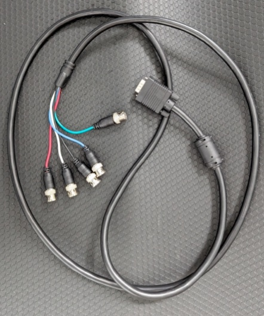
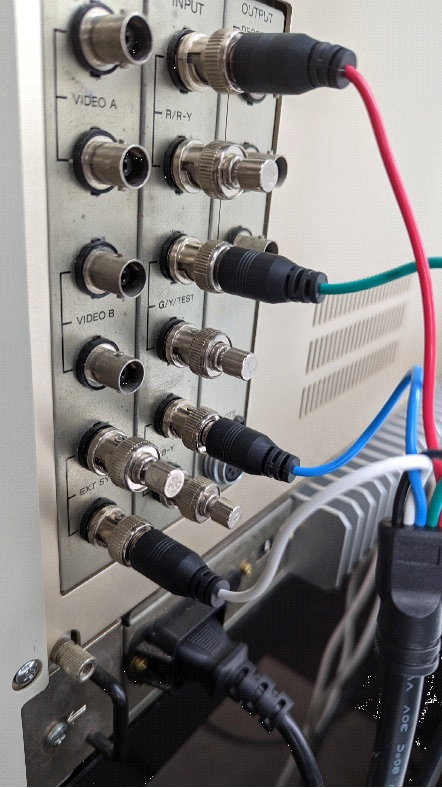
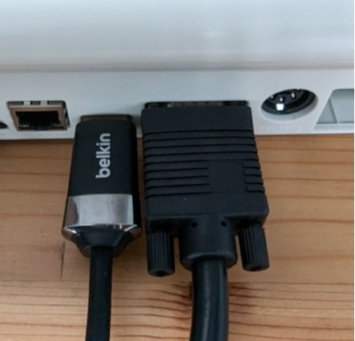
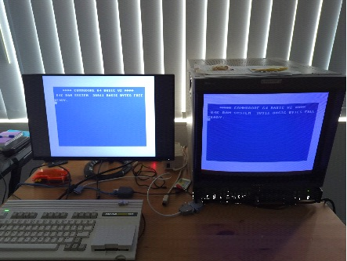
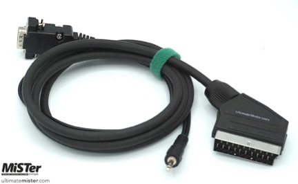
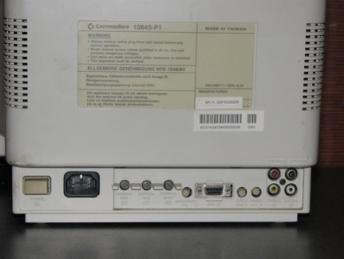

# Using Retro Cathode Ray Tubes

The Amiga 500 core is capable of providing analog retro signals via the VGA
port that have a 15 kHz horizontal frequency and that either use a
horizontal+vertical synchronization signal or a composite synchronization
signal. The signal itself is a
[component signal](https://en.wikipedia.org/wiki/Component_video#Component_versus_composite).

On a 15 kHz CRT you get the most authentic Amiga picture possible: interlace
is displayed natively by the tube (no flicker fixer involved) and the
intentional flicker effects of demos melt on the phosphor exactly as their
authors intended.

**IMPORTANT CAUTIONS:** (Not following these rules might destroy your retro
device)

1. Only connect a retro device while having the 15 kHz retro VGA mode active.
   Never connect using the "Standard" mode which yields 30 kHz or more. High
   horizontal frequencies damage the cathode ray tube.

2. **Always use the right cable.** Particularly when you use SCART, the
   voltages need to be correct and therefore you need to
   [buy a cable with a built-in resistor](#scart).

3. When using retro gear via the MEGA65's VGA port: **Make sure that you
   disable HDMI: Flicker-free**. Flicker-free makes the horizontal sync
   frequency step slightly, which analog monitors dislike. Learn more in the
   [user's manual](../README.md#flicker-free-smooth-motion-menu-entry).

## Configuring the Amiga 500 core

Configure the core *before* you connect your retro monitor:

* Open the on-screen-menu and enter the `VGA:` submenu. Select
  **15 kHz with CSYNC** for SCART, DB9 RGB and most BNC setups, or
  **15 kHz with HS/VS** if your device expects separate horizontal and
  vertical synchronization signals (for example some projectors, plasma TVs
  and multisync monitors). The three VGA modes are described in the
  [user's manual](../README.md#video-vga-port-analog-rgb).

* Turn off **HDMI: Flicker-free**.

Important: Switch from the Standard mode to the retro 15 kHz mode before
turning on the CRT. Providing the CRT with a 31 kHz signal could potentially
damage your equipment. Exercise caution and ensure the correct setting is
selected to avoid damage to the monitor.

Helpful hints:

* The on-screen-menu is oversized in both raw 15 kHz modes. Use the
  **`OSM: 100%`** menu entry (the percentage changes with your selection) to
  choose a smaller size until the menu fits your tube comfortably.

* A regular VGA monitor shows no picture at all in the 15 kHz modes —
  including the on-screen-menu. If you locked yourself out, connect an HDMI
  display and switch back there; both outputs share the same menu.

* Since the HDMI output always runs in parallel, a second HDMI display is
  useful for making the necessary adjustments to the configuration (see
  [Example setup](#example-setup)).

* To move the picture on your tube or to hide ugly border artifacts that
  some demos and games produce, use the analog position and analog overscan
  features described in [Screen adjustment](screen_adjust.md).

## BNC

### VGA to BNC cable

To connect high-end or broadcast/production monitors with BNC connectors for
RGB, you will require a VGA Plug to 5 BNC RGB Male Plugs Video Cable.
However, if you're using it for retro RGB video, connecting 4 plugs should
suffice unless you're connecting to a projector or plasma TV that requires
separate horizontal and vertical syncing signals. The Amiga 500 core also
supports this mode over 15 kHz ("15 kHz with HS/VS"), making it a useful
cable to have.

### Cable and connection details

To set up retro RGB, you'll need three RGB signals along with CSYNC. In the
case of the Amiga 500 core, the horizontal sync will be used as CSYNC.
For CSYNC, you can use the white lead, while the black lead can be left
unconnected. Connect the R (Red), G (Green), and B (Blue) signals to their
respective analog inputs on the device or monitor. Take the CSYNC lead and
connect it to the "external sync" input to the composite input panel.
By following these instructions, you will ensure the proper connection of the
RGB signals and CSYNC for correct functionality.

Connect the opposite end of the cable to the MEGA65's VGA port.

### Example setup

A second monitor on the HDMI output will be useful for making the necessary
adjustments to the configuration.

## SCART and DB9 RGB

Connecting the MEGA65 running the Amiga 500 core to retro tubes such as
Commodore and Philips RGB monitors is more straight forward than on
professional monitors. Make sure you are configuring the core as described
above: [VGA: 15 kHz with CSYNC](#configuring-the-amiga-500-core)

### SCART

For connecting your MEGA65 to a Commodore 1084S or Philips CM8833 monitor
with a SCART input you can use a MiSTer VGA to SCART cable like this one:

See here for where to purchase and availability and also make sure that you
understand the importance of buying a cable that has a built-in resistor
versus simple "pass-through" cables:
https://www.retrorgb.com/beware-of-mister-scart-cables.html

### DB9 RGB

For the later Commodore monitors such as the 1084S-P1 or Philips CM8833
Mark II, these have a DB9 RGB input as pictured below:

Use the following VGA to DB9 RGB cable which can be found
[on eBay (example from Australia, adjust to your country)](https://www.ebay.com.au/itm/115728666823?mkcid=16&mkevt=1&mkrid=705-154756-20017-0&ssspo=VdRmcP3PRmW&sssrc=2047675&ssuid=_M7sYODUQqq&var=415792281593&widget_ver=artemis&media=COPY).
